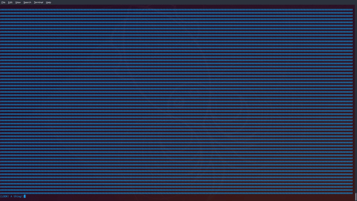

# Sacred
ASCII art import and terminal graphics. IN PYTHON. 



# Installation
Clone repo and install:
```
python3 setup.py install
```

# Documentation
## asciigen.py
Python script for generating ascii json files. All you need to do is to grab some ascii art (from the web or somewhere else), use ./asciigen.py to covert it into json, and:
```
import sacred

scene = sacred.Scene()

sacred.clear()
scene.obj("test.json", 5, 10)
scene.render()
```
Usage:
```
asciigen.py <inputfile> <outputname>
```

The data is in this format:
```
{"line#":["text", SpaceBeforeText]}
```
Where `line#` means which line it is, `text` being what is printed on the line, and `SpaceBeforeText` means the, well, space before the line.
## sacred.Scene(object)
Class for all objects in render. It has the following objects:
### Scene.obj(file, x=0, y=0)
Imports ascii json files.  Those are generated by ./asciigen.py
  

Args:
```
file (str): path to the .json file
x (int): position on the x axis
y (int): position on the y axis
```
### Scene.txt(txt, x=0, y=0)
Adds text to the position (x, y).  
  

Args:
```
txt (str): content to print at (x,y)
x (int): position on the x axis
y (int): position on the y axis
```
### Scene.box(x=0, y=0, w=t.width - 1, h=t.height - 1, fill=" ")
Adds a box on terminal. Creates a box around the terminal by default. (Note that a character on the terminal is a tall rectangle, which means that having the same height and width does not create a square.)
  
  
*Example:*
```
import sacred

scene = sacred.Scene() 

scene.box(5, 5, 10, 10, fill="*")
scene.render()
```
*Output:*
```


     ----------
     |********|
     |********|
     |********|
     |********|
     |********|
     |********|
     |********|
     |********|
     ----------

     
```
  
Args:
```
x (int): position on x axis
y (int): position on y axis
w (int): width (by char)
h (int): height (by char)
fill (str): content that fills inside box. (Will return ValueError if fill is more than one char.)
```

### Scene.render()
Prints (or render, if you prefer) all the objects added. Note that it prints in the order of the added objects, so each object acts more like a layer.
  
So if:
```
scene.box(5, 5, 10, 10, fill="*")
scene.box(6, 6, 10, 10) # the box will be filled by a space character (" ")
scene.render()
```
then this happens:
```


    ----------
    |        |
    | ----------
    | |********|
    | |********|
    | |********|
    | |********|
    | |********|
    | |********|
    --|********|
      |********|
      ----------


```

## sacred.TooLarge(Exception)
Error raised when the objects that are added are bigger than the width of the terminal itself.

So if you do this in a 80x24 terminal:
```
scene.box(0, 0, 500, 500)
scene.render()
```
then this happens:
```
Scene exceeds terminal width
User: If possible, maximize the terminal window.
Dev: Make sure your x values are in check.
Traceback (most recent call last):
  File "test.py", line 7, in <module>
    scene.render()
  File "/home/henry/Github/sacred/sacred.py", line 47, in render
    printobj(obj, self.pos[i][0], self.pos[i][1])
  File "/home/henry/Github/sacred/sacred.py", line 83, in printobj
    raise TooLarge
sacred.TooLarge
```

## sacred.fill(txt, delay=0, diag=True)
Fills screen with `txt`.

Example:
```
import sacred

scene = sacred.Scene()

sacred.clear()
sacred.fill("#")
scene.txt("IFR is foggy", y=23)
scene.render()
input()
```

Output:
```
###############################################################################
###############################################################################
###############################################################################
###############################################################################
###############################################################################
###############################################################################
###############################################################################
###############################################################################
###############################################################################
###############################################################################
###############################################################################
###############################################################################
###############################################################################
###############################################################################
###############################################################################
###############################################################################
###############################################################################
###############################################################################
###############################################################################
###############################################################################
###############################################################################
###############################################################################
IFR is foggy
```
By default, there is a space underneath the fill to accommodate for printing text for messages.

Args:
```
txt (str): Character to fill terminal. Will return ValueError if more than one char.
delay (int): Delay set for printing each line.
diag (bool):  Determines whether to put a blank line underneath the fill or not.
```
## sacred.printobj(js, x, y):
Used internally to print ascii json files. 

Args:
```
js (json): ascii json files should go here
x (int): Position on x axis
y (int): Position on y axis
```
## sacred.txtbox(txt, x=0, y=t.height - 1)
When `input()` is not enough. This is basically a moveable version of that, where you can set the position of it at anywhere.

By default, it prints from the bottom of the terminal.
## sacred.clear()
Clears terminal, for when you are too lazy to type `print(t.clear())`.

